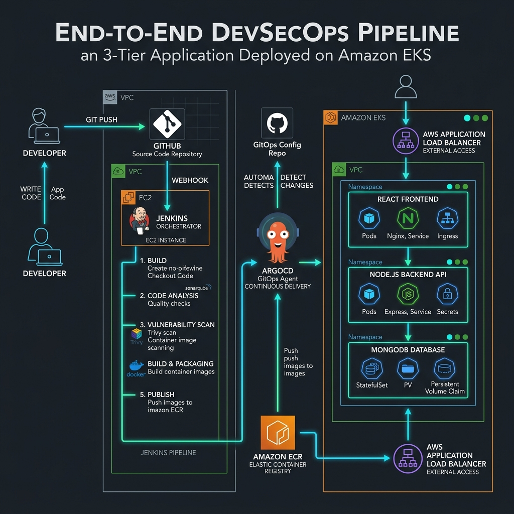

# End-to-End Kubernetes Three-Tier DevSecOps Project



## Overview
This repository contains a full End-to-End DevSecOps pipeline for a modern 3-Tier Application (React Frontend, Node.js API, MongoDB). The architecture demonstrates state-of-the-art CI/CD and GitOps practices deployed natively onto an Amazon EKS cluster.

## Architecture & Workflow
1. **GitHub Pipeline**: Developers push code changes to this repository.
2. **Jenkins CI/CD**: A declarative `Jenkinsfile` pipeline is triggered automatically.
3. **Continuous Security**:
   - **SonarQube** handles static code analysis and enforces a strict Code Quality Gate.
   - **OWASP Dependency-Check** scans `npm` packages for known external vulnerabilities.
   - **Trivy** performs advanced filesystem and Docker registry vulnerability scanning.
4. **Container Registry**: A Docker image is built and pushed securely to AWS Elastic Container Registry (ECR).
5. **GitOps Updates**: Jenkins actively modifies the `deployment.yaml` in the GitHub repo with the latest Image Tag.
6. **ArgoCD (CD)**: ArgoCD watches the repository, detects the updated tag, and seamlessly syncs the deployment to the live Amazon EKS cluster with zero downtime.

## Project Structure
```tree
End-to-End-Kubernetes-Three-Tier-DevSecOps-Project/
├── Application-Code/       # Source Code for Frontend (React UI) and Backend (Node.js API)
├── Jenkins-ci-cd/          # Jenkins Declarative Pipelines
│   ├── Jenkinsfile-Frontend
│   └── Jenkinsfile-Backend
├── Jenkins-Terraform/      # IaC to provision the core EC2 Jenkins & SonarQube Server
├── Kubernetes/             # Kubernetes Manifests (Deployed via ArgoCD GitOps)
│   ├── Frontend/           # Frontend Deployment & Service
│   ├── Backend/            # Node API Deployment & Service
│   └── Database/           # MongoDB Deployment & Service (Internal Network Access Only)
└── ingress.yaml            # AWS ALB Ingress Controller rules exposing the Frontend & API securely
```

## Next Steps
**1. Provision Jenkins Server**
Execute the Terraform scripts located in `Jenkins-Terraform/` to deploy an EC2 instance. The provided `tools-install.sh` bootstrap script will automatically install Docker, Jenkins, SonarQube, Trivy, and `eksctl`.

**2. Configure CI Pipeline**
Import the Jenkinsfiles into your Jenkins server to build and push your Docker containers to ECR. The pipeline is fully automated and will aggressively manage its own Kubernetes manifests.

**3. Deploy to Amazon EKS**
Use AWS `eksctl` to provision a Kubernetes cluster, install the AWS ALB Ingress Controller, and deploy ArgoCD to sync the manifests!
